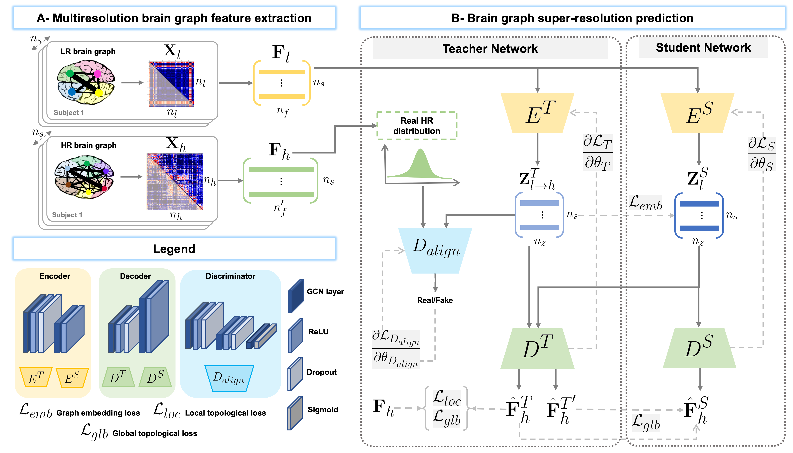

# L2S-KDnet: Learn to SuperResolve Brain Graphs with Knowledge Distillation Network

This repository provides the official PyTorch implementation of the following paper:



> **Inter-Domain Alignment for Predicting High-Resolution Brain Networks Using Teacher-Student Learning**
>
> Başar Demir<sup>1,†</sup>, Alaa Bessadok<sup>1,2,3,†</sup> and Islem Rekik<sup>1</sup>
>
> <sup>1</sup>BASIRA Lab, Faculty of Computer and Informatics, Istanbul Technical University, Istanbul, Turkey<br/>
> <sup>2</sup>Higher Institute of Informatics and Communication Technologies, University of Sousse, Tunisia, 4011<br/>
> <sup>3</sup>National Engineering School of Sousse, University of Sousse, LATIS- Laboratory of Advanced Technology and Intelligent Systems, Sousse, Tunisia, 4023<br/>
> <sup>†</sup>Equal Contribution<br/>
> 
> **Abstract:** *Accurate and automated super-resolution image synthesis is highly desired since it has the great potential to circumvent the need for acquiring high-cost medical scans and a time-consuming preprocessing pipeline of neuroimaging data. However, existing deep learning frameworks are solely designed to predict high-resolution (HR) image from a low-resolution (LR) one, which limits their generalization ability to brain graphs (i.e., connectomes). A small body of works has focused on superresolving brain graphs where the goal is to predict a HR graph from a single LR graph. Although promising, existing works mainly focus on superresolving graphs belonging to the same domain (e.g., functional), overlooking the domain fracture existing between multimodal brain data distributions (e.g., morphological and structural). To this aim, we propose a novel inter-domain adaptation framework namely, Learn to SuperResolve Brain Graphs with Knowledge Distillation Network (L2S-KDnet), which adopts a teacher-student paradigm to superresolve brain graphs. Our teacher network is a graph encoder-decoder that firstly learns the LR brain graph embeddings, and secondly learns how to align the resulting latent representations to the HR ground truth data distribution using an adversarial regularization. Ultimately, it decodes the HR graphs from the aligned embeddings. Next, our student network learns the knowledge of the aligned brain graphs as well as the topological structure of the predicted HR graphs transferred from the teacher. We further leverage the decoder of the teacher to optimize the student network. In such a way, we are not only bringing the learned embeddings from both networks closer to each other but also their predicted HR graphs. L2S-KDnet presents the first TS architecture tailored for brain graph super-resolution synthesis that is based on inter-domain alignment. Our experimental results demonstrate substantial performance gains over benchmark methods.*

This work is accepted at the 1st workshop on “Affordable Healthcare and AI for Resource Diverse Global Health” (FAIR) at MICCAI 2021, in Strasbourg.

Please contact [basardemir1@gmail.com](mailto:basardemir1@gmail.com) for further inquiries. Thanks.

## Installation

### *Anaconda Environment Installation*

* Go to https://www.anaconda.com/products/individual
* Get the version that is suitable for your system.
* Create a conda environment by using following command:

```sh
$ conda create --name basira-l2skdnet python=3.8
```

### *Dependency Installation*

Copy and paste the following commands to install all packages. They will directly download the required packages to your environment.

```sh
$ conda activate basira-l2skdnet
$ pip install -r requirements.txt 
```

## Data format

In our paper, we have used a dataset derived from the Southwest University Longitudinal Imaging Multimodal (SLIM) Brain Data Repository.

For this repository, we have simulated LR (morphological low-resolution brain connectome) which is n<sub>s</sub> x n<sub>f</sub> matrix and HR (functional high-resolution brain connectome) which is n<sub>s</sub> x n'<sub>f</sub> matrix. n<sub>f</sub> denotes the number of connections between nodes and it can be calculated as n<sub>f</sub> = r x (r-1)/2 where r is the number of nodes in the graph.

The simulated data that contains 100 x 595 (35x35) matrix as LR and 100 x 12720 (160x160) matrix as HR can be found in the 'simulated_data' folder.

Randomly generated data might cause suboptimal results since it is not a real brain graph data.

## Run L2S-KDnet

To run the code, following command should be typed into the terminal

```sh
$ conda activate L2SKDnet & python demo.py
```

##### You may use program arguments to tune hyperparameters, configure training or supply your own dataset.

## Components of L2S-KDnet’s Files and Folders

| Component             | Content                                                                                 |
| --------------------- | --------------------------------------------------------------------------------------- |
| model.py              | Implementation of the GCN and Teacher-Student models.                                   |
| demo.py               | Driver code that trains and tests L2S-KDnet with cross-validation.                      |
| helper.py             | Includes some functions that handle basic operation.                                    |
| data_loader.py        | Handles loader operations for the dataset.                                              |
| centrality.py         | Includes function that calculates centrality metrics for a given graph.                 |
| simulated_data/       | Includes simulated dataset that indicates data format.                                  |
| benchmark_methods/    | Includes implementations of benchmark methods that are written in the paper.            |
| output/\<model name\>/| Keeps all required information about the running model such as plots, logs and results. |

##### output/\<model name\>/ directory automatically created by demo.py

## Essential Arguments of L2S-KDnet

| Argument                   | Explanation                          |
| -------------------------- | ------------------------------------ |
| model                      | TS model name                        |
| lr                         | LR graph input path                  |
| hr                         | HR graph input path                  |
| num_iters                  | number of iterations                 |
| num_splits                 | number of folds for cross-validation |
| g_lr                       | generator learning rate              |
| d_lr                       | discriminator learning rate          |
| local_topology_loss_weight | multiplier for local topology loss   |
| teacher_loss_weight        | multiplier for teacher loss          |
| beta1                      | beta1 for Adam optimizer             |
| beta2                      | beta2 for Adam optimizer             |

To reach all arguments and their detailed explanations, run the following command:

```sh
$ python demo.py --help
```

## Example Result

The figure demonstrates an example of output for default parameter settings. Dataset consist of LR matrices that are 35x35 and HR matrices that are 160x160.


# L2S-KDnet paper on arXiv:

Coming up soon.

# Please cite the following paper when using L2S-KDnet:

Coming up soon.
